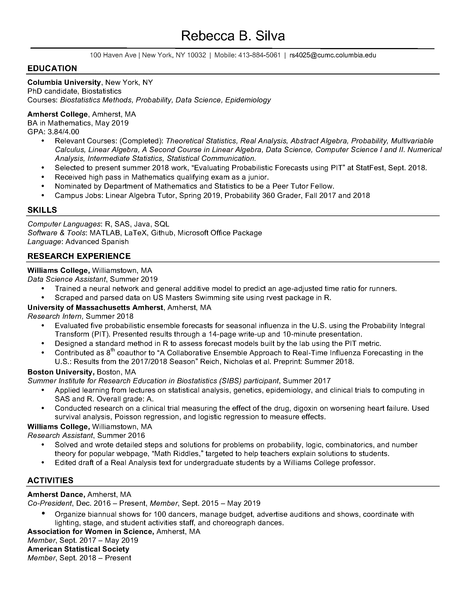

In my first first as a Biostatistics PhD student I am taking four classes and doing research with Dr. Shing Lee on the continual reassessment method. 

My research experience with prediction modeling and interest in clinical trials have led me to want to look more closely at clinical trials methodology, improving effectiveness of treatment diagnosis by predicting outcomes. I graduated from Amherst College with a BA in Mathematics in 2019. See my resume below. 

{width=65%}