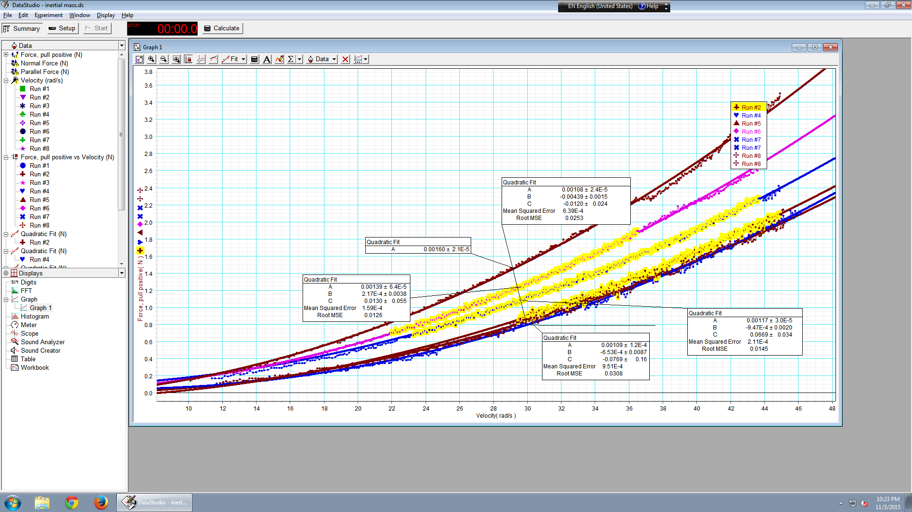

# This is Rebecca's website

# letss add some links

I often use [google](https://www.google.com) to do **data science**. 

## add image

here a physics thing 
 (can add subdirectory images then images/intertial2.png..)

# more than one page 
 You can learn about me [here](aboutme.html)
 
 
