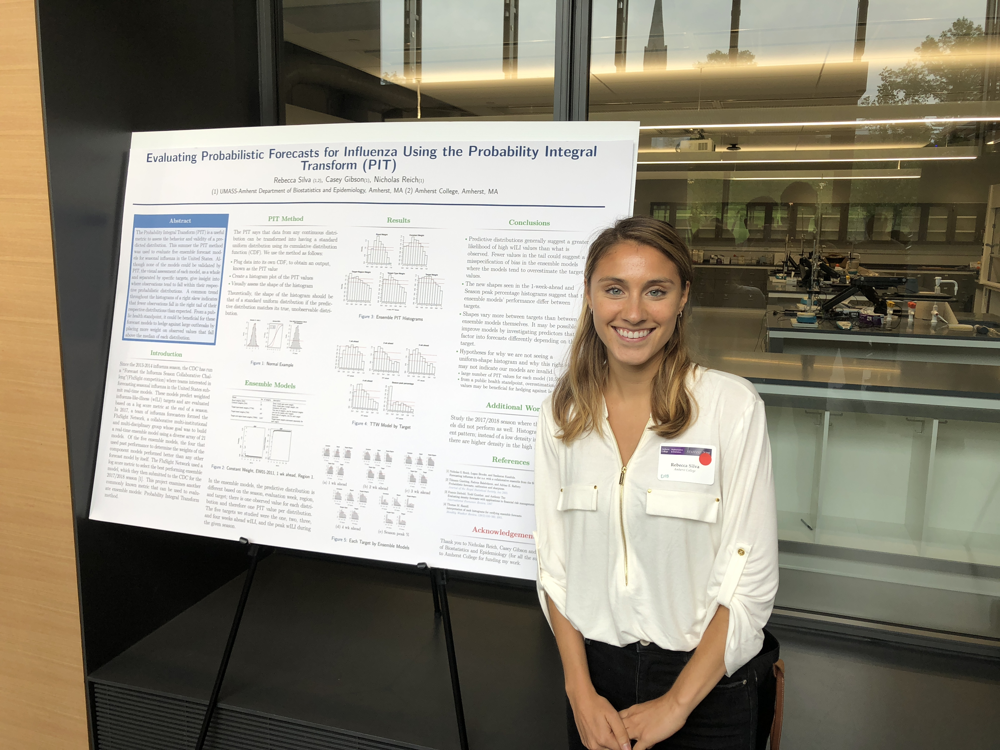

# Summer 2019

I worked under Dick DeVeaux, a statistics professor at Williams College, training a neural network and general additive model to predict an age-adjusted time ratio for runners. Specifically, I used data from the Dipsea Race in California which is a race where the goal is for all participants to finish together. Therefore each person gets a headstart depending on sex and age. Our goal was to build a model to better optimize the head starts in the Dipsea Race so that runners of any age had an equal chance of winning. In the past decade, the winners of the Dipsea Race have been in or around their 60s, and we want a model that makes it possible for runners with no head start to catch up.

You can read more about my work and view my code [here](https://github.com/rsilva19/Dipsea_Race). 

# Summer 2018

I was a research intern at Nicholas Reich’s Biostatistics Lab in the Department of Biostatistics and Epidemiology at the University of Massachusetts Amherst. I worked independently on goodness of fit measures of probabilistic ensemble models. These ensemble models consisted of a variety of time series models that forecast seasonal influenza in the U. S. and I chose to use the Probability Integral Transform (PIT) to assess the behavior and validity of the predicted distributions given by the five different ensemble models. I studied literature on the PIT and taught myself background on other goodness of fit measures and types of time series models, specifically the SARIMA model and KDE model. I then built a method in R to assess the lab’s probabilistic forecast models. Instead of only performing the previously used log score metric, the lab can now use a more comprehensive method of visual assessment through a PIT histogram to understand their models’ performances.

You can view my code [here](https://github.com/rsilva19/Summer-EnsembleForecast-PIT). 

Here I am presenting my work at StatFest 2018. 

